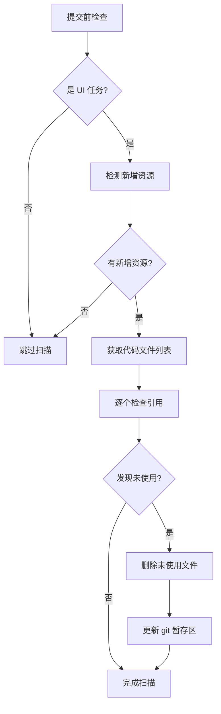

# 资源文件自动清理功能

## 功能概述

在智慧编码流程的**阶段 2.2**中，针对 UI 修改任务，自动扫描并清理未使用的新增资源文件。

## 触发条件

满足以下**任一条件**时触发资源扫描：

1. 任务描述中包含 UI 相关关键词：
   - `UI`、`界面`、`页面`、`样式`、`设计`、`布局`
   - `组件`、`视图`、`前端`

2. Git 暂存区中有新增的资源文件

## 支持的资源类型

### 图片文件
- `.png`, `.jpg`, `.jpeg`, `.gif`
- `.svg`, `.webp`, `.avif`, `.ico`

### 字体文件
- `.woff`, `.woff2`
- `.ttf`, `.otf`, `.eot`

### 媒体文件
- 视频：`.mp4`, `.webm`
- 音频：`.mp3`, `.ogg`, `.wav`

### 其他资源
- `.pdf`

## 检测逻辑

### 1. 资源文件检测

扫描 Git 暂存区中所有新增（`--diff-filter=A`）的资源文件。

```bash
git diff --cached --name-only --diff-filter=A | grep -E "\.(png|jpg|...)"
```

### 2. 引用检查

在以下类型的代码文件中搜索资源文件引用：

**代码文件**：
- JavaScript/TypeScript: `.js`, `.ts`, `.jsx`, `.tsx`
- 框架文件: `.vue`, `.svelte`

**样式文件**：
- `.css`, `.scss`, `.sass`, `.less`, `.styl`

**配置与标记文件**：
- `.html`, `.json`, `.yaml`, `.yml`
- `.md`, `.mdx`

### 3. 引用模式

支持检测以下引用方式：

```javascript
// 1. import 语句
import logo from './assets/logo.png'
import { ReactComponent as Icon } from './icons/icon.svg'

// 2. require 语句
const img = require('../images/photo.jpg')

// 3. 动态导入
const icon = await import(`./assets/${name}.png`)

// 4. URL 字符串


// 5. CSS url()
background: url('./bg.png');
background-image: url('../images/hero.jpg');

// 6. 仅文件名引用（不带扩展名）
import logo from '@/assets/logo'  // 对应 logo.png
```

### 4. 特殊处理

#### Public 目录静态资源

对于 `public/` 目录下的资源，可能通过 URL 直接访问：

```html
<!-- public/favicon.ico -->
<link rel="icon" href="/favicon.ico" />

<!-- public/images/logo.png -->

```

检测策略：
- 搜索文件名
- 搜索从 `/` 开始的路径（去掉 `public` 前缀）

#### 路径别名

支持常见的打包工具路径别名：

```javascript
// webpack/vite alias: @ -> src
import logo from '@/assets/logo.png'

// 检测策略：同时搜索别名路径和实际路径
```

#### 动态引用

对于动态引用，采用模糊匹配：

```javascript
// 这种情况下，icon-*.png 都会被认为是使用的
const icon = require(`./icons/icon-${theme}.png`)
```

## 执行流程



## 使用方法

### 方式 1：集成到智慧编码 Skill

AI 会在阶段 2.2 自动执行资源扫描。无需手动干预。

### 方式 2：手动执行脚本

```bash
# 1. 确保代码已暂存
git add .

# 2. 运行扫描脚本
./skills/智慧编码/resource-scanner.sh

# 3. 查看结果并提交
git commit -m "feat: xxx"
```

## 输出示例

```
🔍 智慧编码 - 资源文件扫描与清理
━━━━━━━━━━━━━━━━━━━━━━━━━━━━━━━━━━━━━━━━
📦 检测新增的资源文件...
📊 发现 5 个新增资源文件

📝 准备代码文件索引...
📚 将在 123 个代码文件中搜索引用

🔎 检查: src/assets/logo.png
  ✅ 已使用

🔎 检查: src/assets/unused-icon.svg
  ⚠️  未使用

🔎 检查: public/favicon.ico
  ✅ 已使用

━━━━━━━━━━━━━━━━━━━━━━━━━━━━━━━━━━━━━━━━
📊 扫描结果统计：
   总计: 5 个文件
   已使用: 4 个文件
   未使用: 1 个文件

🗑️  清理未使用的资源文件：
  ✅ 已删除: src/assets/unused-icon.svg

✅ 资源文件清理完成
━━━━━━━━━━━━━━━━━━━━━━━━━━━━━━━━━━━━━━━━
```

## AI 实现建议

### 1. 任务类型检测

```javascript
function isUITask(requirements) {
  const uiKeywords = [
    'UI', '界面', '页面', '样式', '设计', '布局',
    '组件', '视图', '前端', 'CSS', 'HTML'
  ]

  return uiKeywords.some(kw => requirements.includes(kw))
}
```

### 2. 智能引用检查

使用多种模式匹配：

1. **精确匹配**：完整文件名和路径
2. **模糊匹配**：不带扩展名的文件名
3. **路径变体**：考虑相对路径、绝对路径、别名路径

### 3. 误删除保护

以下情况**不应删除**：

- `favicon.ico`, `robots.txt` 等特殊文件
- `README.md`, `LICENSE` 等文档文件
- 配置文件中引用的资源（即使未在代码中直接引用）

### 4. 用户通知

在日志中清晰展示：
- 扫描了多少文件
- 发现了哪些未使用的文件
- 删除了哪些文件

## 注意事项

1. **仅检查新增文件**：不会影响已存在的资源文件
2. **仅在提交前执行**：确保在 `git add` 之后、`git commit` 之前运行
3. **可恢复性**：如果误删，可以通过 `git checkout` 恢复
4. **配置灵活性**：可以通过 `DEVELOPMENT/config.json` 配置扫描规则

## 未来优化方向

1. **配置化扫描规则**：
   - 自定义资源文件扩展名
   - 自定义排除目录
   - 自定义保护文件列表

2. **更智能的引用检测**：
   - 支持 AST 分析（而非简单的文本搜索）
   - 支持 webpack/vite 配置解析
   - 支持 CSS Modules 等高级特性

3. **交互式确认**：
   - 在删除前向用户展示清单
   - 允许用户选择保留某些文件

4. **与 CI 集成**：
   - 作为 pre-commit hook
   - 作为 CI 检查步骤
