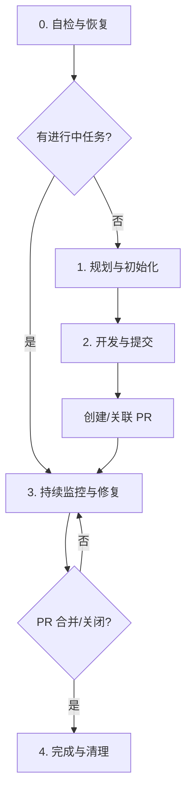

# 智慧编码 Skill

这是一个完整的自动化开发部署流程，从需求分析到 PR 合并的全过程自动化。

**注意**：此 Skill 适用于各种 AI 助手（Claude、GPT、Gemini 等）。提交信息使用通用的 "AI Assistant" 签名。

## 🛡️ 核心原则与规则

**核心理念：AI 是全自动化的执行者，而非提醒者。**

### 1. 全自动化闭环 (The Loop)
*   **立即监控**：创建 PR 后，**立即**启动后台监控循环，无需用户确认。
*   **持续运行**：监控必须持续运行，直到 PR 被合并、关闭或用户明确发出“暂停”指令。
*   **自动修复**：发现 CI 失败、冲突或新评论时，AI 必须**自动**分析、修改代码、提交并回复，绝不只记录日志等待用户。

### 2. 零打扰原则 (Zero User Intervention)
*   ❌ **禁止**：问“需要我继续监控吗？”、“是否开始监控？”或“需要您处理这个问题”。
*   ❌ **禁止**：因遇到问题而暂停监控循环。
*   ✅ **必须**：遇到问题自己解决，解决不了记录到日志并继续下一个检查周期。

### 3. 工作流规范 (Workflow Compliance)
*   **同步**：在开始新任务前，确保主分支最新。
*   **清理**：如果当前位于已合并的分支，自动切回主分支并更新。

---

## 🔄 完整工作流程



## 阶段 0: 状态自检与恢复 (Self-Check & Resume)

**⚠️ 入口规则：AI 响应指令前必须先执行此检查。**

### 0.1 检查 Git 状态与清理 (workflow.md 集成)

```bash
# 获取当前分支和主分支
CURRENT_BRANCH=$(git rev-parse --abbrev-ref HEAD)
# 自动检测主分支 (尝试从 origin/HEAD 获取，默认 master)
MAIN_BRANCH=$(git symbolic-ref refs/remotes/origin/HEAD 2>/dev/null | sed 's@^refs/remotes/origin/@@')
MAIN_BRANCH=${MAIN_BRANCH:-"master"}

# 检查当前分支是否已合并 (Workflow 规范)
if [ "$CURRENT_BRANCH" != "$MAIN_BRANCH" ]; then
    PR_STATE=$(gh pr view --json state -q '.state' 2>/dev/null)
    if [ "$PR_STATE" = "MERGED" ]; then
        echo "⚠️ 当前分支 $CURRENT_BRANCH 已合并。"
        echo "🔄 自动执行回归操作：切换回 $MAIN_BRANCH 并拉取最新代码..."
        git checkout "$MAIN_BRANCH"
        git pull origin "$MAIN_BRANCH"
        # 清理旧的 DEVELOPMENT 目录（如果存在）
        [ -d "DEVELOPMENT" ] && rm -rf "DEVELOPMENT"
        echo "✅ 已回归主分支，准备接受新任务。"
        exit
    fi
fi
```

### 0.2 检查断点恢复

```bash
# 检查 DEVELOPMENT 目录信标
if [ -d "DEVELOPMENT" ] && [ -f "DEVELOPMENT/config.json" ]; then
    echo "✅ 发现进行中的智慧编码任务，正在恢复..."

    # ⚠️ 重要提示：即使 DEVELOPMENT/requirements.md 被 .gitignore 忽略，AI 也必须阅读它以获取上下文
    # AI 应通过 shell 命令（如 cat）读取，因为常规工具可能因忽略规则而受限
    if [ -f "DEVELOPMENT/requirements.md" ]; then
        echo "📝 发现需求文档，正在读取上下文..."
    fi

    PR_NUMBER=$(jq -r '.pr.number // empty' DEVELOPMENT/config.json)
    
    if [ -n "$PR_NUMBER" ]; then
        echo "📊 状态：阶段 3 (持续监控)。PR #$PR_NUMBER"
        echo "🤖 行动：立即恢复监控循环。"
        # -> 跳转到 阶段 3
    else
        echo "📊 状态：阶段 2 (开发中)。"
        echo "🤖 行动：准备继续开发或提交。"
        # -> 跳转到 阶段 2
    fi
    exit
fi
```

### 0.3 检查隐式任务 (隐式开发检测)

```bash
# 仅在无 DEVELOPMENT 目录时执行
if [ ! -d "DEVELOPMENT" ]; then
    # 检查是否有未提交的修改 (unstaged or staged)
    if ! git diff --quiet || ! git diff --cached --quiet; then
        echo "⚠️  发现未提交的代码修改。"
        
        # 简单展示修改的文件
        echo "📂 修改的文件："
        git status --short

        # 提示 AI 介入
        echo "🤖 建议：看起来您已经开始了一些工作。"
        echo "   请分析上述修改，推断任务目标，并询问用户是否基于此创建新任务。"
        
        # 标记状态供 AI 识别，并退出自检流程，转入与用户交互
        echo "STATUS: IMPLICIT_TASK_DETECTED"
        exit
    fi
fi
```

---

## 阶段 1: 规划与初始化 (Plan & Init)

### 1.1 确认需求与规划

与用户对话，确认功能描述、技术方案和验收标准。

### 1.2 初始化环境

```bash
# 1. 确保在项目根目录
cd "$(git rev-parse --show-toplevel)"

# 2. 读取基础规范
# Read ../auto_coding/prompt/general.basic.md

# 3. 创建分支 (如果不在特性分支)
BRANCH_NAME="feature-xxx" # 根据任务生成
git checkout -b "$BRANCH_NAME"

# 4. 创建 DEVELOPMENT 目录结构
mkdir -p DEVELOPMENT
# 创建 config.json 和 requirements.md (参考旧版内容，此处省略详细 heredoc 以节省篇幅)
```

**关键点**：确保 `DEVELOPMENT/config.json` 和 `DEVELOPMENT/requirements.md` 被正确创建，用于状态持久化。

---

## 阶段 2: 开发与提交 (Develop & Submit)

### 2.1 编码与测试

1.  **加载规范**：读取 `../auto_coding/prompt/loader.md` (或 config 中指定的路径)。
2.  **开发**：使用 `Read`, `Edit`, `Write` 工具。
3.  **测试**：运行 `npm test` 或相应测试命令。

### 2.2 资源文件扫描与清理

**⚠️ 仅在 UI 修改任务时执行此步骤**

如果任务涉及 UI 修改，在提交前检查所有新增的资源文件（图片、字体、音视频等）是否被使用：

```bash
# 1. 检测新增的资源文件
echo "🔍 扫描新增的资源文件..."
RESOURCE_EXTENSIONS="png|jpg|jpeg|gif|svg|webp|ico|woff|woff2|ttf|otf|mp4|mp3|webm|pdf"
NEW_RESOURCES=$(git diff --cached --name-only --diff-filter=A | grep -E "\.(${RESOURCE_EXTENSIONS})$")

if [ -n "$NEW_RESOURCES" ]; then
    echo "📦 发现 $(echo "$NEW_RESOURCES" | wc -l) 个新增资源文件"

    # 2. 检查每个资源文件是否被引用
    UNUSED_FILES=""
    echo "$NEW_RESOURCES" | while read -r file; do
        FILENAME=$(basename "$file")
        FILENAME_NO_EXT="${FILENAME%.*}"

        # 在代码中搜索文件引用（相对路径、绝对路径、文件名）
        # 搜索范围：所有代码文件（js, ts, jsx, tsx, vue, css, scss, html 等）
        REFERENCES=$(git ls-files | grep -E "\.(js|ts|jsx|tsx|vue|css|scss|sass|less|html|json|md)$" | xargs grep -l -F -e "$FILENAME" -e "$file" 2>/dev/null || true)

        if [ -z "$REFERENCES" ]; then
            echo "⚠️  未使用: $file"
            UNUSED_FILES="$UNUSED_FILES\n$file"
        else
            echo "✅ 已使用: $file"
        fi
    done

    # 3. 清理未使用的文件
    if [ -n "$UNUSED_FILES" ]; then
        echo "🗑️  清理未使用的资源文件..."
        echo -e "$UNUSED_FILES" | while read -r file; do
            [ -n "$file" ] && rm -f "$file" && echo "  已删除: $file"
        done

        # 更新 git 暂存区
        git add -u
        echo "✅ 资源文件清理完成"
    else
        echo "✅ 所有资源文件都已被使用"
    fi
else
    echo "ℹ️  没有新增资源文件"
fi
```

**AI 实现要点**：

1. **智能检测任务类型**：
   - 检查需求描述中是否包含"UI"、"界面"、"页面"、"样式"、"设计"等关键词
   - 检查是否有新增的资源文件（图片、字体等）
   - 如果满足条件，执行资源扫描

2. **资源文件识别**：
   - 图片：`.png`, `.jpg`, `.jpeg`, `.gif`, `.svg`, `.webp`, `.ico`, `.avif`
   - 字体：`.woff`, `.woff2`, `.ttf`, `.otf`, `.eot`
   - 媒体：`.mp4`, `.mp3`, `.webm`, `.ogg`, `.wav`
   - 其他：`.pdf`, `.zip` (如果是资源文件)

3. **引用检查策略**：
   - 搜索代码文件中的文件名引用
   - 支持多种引用方式：
     - 相对路径：`./images/logo.png`、`../assets/icon.svg`
     - 绝对路径：`/assets/logo.png`
     - 仅文件名：`logo.png`
     - 无扩展名：`logo` (常见于 import 语句)
     - CSS/SCSS 中的 url()：`url('./logo.png')`

4. **扫描范围**：
   - 代码文件：`.js`, `.ts`, `.jsx`, `.tsx`, `.vue`, `.svelte`
   - 样式文件：`.css`, `.scss`, `.sass`, `.less`, `.styl`
   - 配置文件：`.json`, `.yaml`, `.yml`
   - 标记文件：`.html`, `.md`, `.mdx`

5. **特殊处理**：
   - 对于 public 目录的静态资源，可能通过 URL 直接访问，需要额外检查
   - 对于动态引用（如 `require(\`./images/\${name}.png\`)`），需要更智能的分析
   - 考虑 webpack/vite 等打包工具的别名配置（如 `@/assets/logo.png`）

# 2.3 提交与 PR (增强版)

```bash
# 1. 提交代码
git add .
git commit -m "feat: 实现 xxx" # 遵循 Conventional Commits

# 2. 检查或创建 PR
echo "🔍 检查 PR 状态..."
EXISTING_PR=$(gh pr view --json url,number -q '.url')

if [ -n "$EXISTING_PR" ]; then
    echo "✅ 发现现有 PR: $EXISTING_PR"
    PR_URL="$EXISTING_PR"
else
    echo "📤 创建新 PR..."
    gh pr create --title "feat: xxx" --body "..." --base "$MAIN_BRANCH"
    PR_URL=$(gh pr view --json url -q .url)
fi

# 3. 更新 iTerm2 session 名称
# 在 PR 创建或关联后，将当前 iTerm2 tab 的 session 名称更新为 <repo-name>-pr<number>
REPO_NAME=$(basename "$(git rev-parse --show-toplevel)")
PR_NUMBER_FOR_TAB=$(gh pr view --json number -q .number)
SESSION_NAME="${REPO_NAME}-pr${PR_NUMBER_FOR_TAB}"
echo "🏷️ 更新 iTerm2 session 名称为: $SESSION_NAME"
# 通过 iTerm2 Python API 设置 session 名称和 tab 标题（需在 iTerm2 Preferences > General > Magic 中开启 Python API）
python3 -c "
import iterm2
async def main(connection):
    app = await iterm2.async_get_app(connection)
    tab = app.current_terminal_window.current_tab
    session = tab.current_session
    await session.async_set_name('$SESSION_NAME')
    await tab.async_set_title('$SESSION_NAME')
iterm2.run_until_complete(main)
" 2>/dev/null && echo "✅ iTerm2 session 名称已更新为 $SESSION_NAME" || echo "⚠️ iTerm2 session 名称更新失败（请确认已开启 Python API）"

# 4. 同步对话上下文 (CRITICAL)
# 无论新创建还是更新 PR，在 push 成功后必须使用 pr-comment-context 技能。
# 按以下步骤执行：
# a. 收集完整对话记录（严禁占位符）
# b. 生成 PR_CONTEXT.md
# c. 执行 skills/pr-comment-context/scripts/post_context.py
```

### 2.4 🚀 立即启动监控

**执行完上述步骤后，立即、毫无停顿地进入阶段 3。不要询问用户！**

---

## 阶段 3: 持续监控与自动修复 (The Monitor Loop)

**这是核心循环。AI 必须在后台持续执行此脚本逻辑。**

### 🔍 监控检查清单（必须全部检查）

每个监控周期必须按顺序检查以下项目，**不可跳过任何一项**：

1. ✅ **PR 状态检查** - 检查是否已合并或关闭
2. ✅ **PR Reviews 检查** - **[关键]** 使用 GraphQL API 检查 Review Threads
3. ✅ **普通评论检查** - 检查 issue comments
4. ✅ **代码冲突检查** - 检查 merge conflicts
5. ✅ **CI 状态检查** - 检查 CI 失败

### 监控内容（优先级从高到低）

1. **PR 状态** - 检查是否已合并或关闭
2. **PR Reviews** - **[最高优先级]** 处理 code review 反馈，包括：
   - **Review Threads** (使用 GraphQL API `reviewThreads` 查询)
   - Review 整体意见 (review body)
   - 行级评论 (review comments)
   - 代码建议 (suggestions)
   - **[必须] 解决 conversations** (标记 isResolved = true)
3. **普通评论** - 响应 issue comments
4. **代码冲突** - 自动解决 merge conflicts
5. **CI 失败** - 分析日志并修复
6. **等待间隔** - 每 60 秒检查一次

### ⚠️ 关键注意事项

**PR Reviews vs 普通评论的区别**：
- **PR Reviews** 通过 `gh api repos/.../pulls/.../reviews` 或 GraphQL `reviewThreads` 获取
- **普通评论** 通过 `gh pr view --json comments` 获取
- **必须分别检查**，不能只检查其中一个

**常见遗漏错误**：
- ❌ 只检查 `gh pr view --json comments` (会遗漏 Review Threads)
- ❌ 只回复评论，不解决 conversations (PR 可能无法合并)
- ❌ 使用 REST API 但忘记解决 GraphQL 的 reviewThreads

**正确做法**：
1. 使用 GraphQL API 查询所有 `reviewThreads`
2. 检查每个 thread 的 `isResolved` 状态
3. 处理完反馈后，使用 `resolveReviewThread` mutation 标记为已解决
4. 验证所有 threads 都已解决

**优先级说明**：无论 CI 处于何种状态（运行中、失败、成功），都会优先处理 PR 中的评论和 Review 反馈。这确保人工反馈能够得到最快响应。

```bash
# 初始化
MONITOR_CYCLE=0
PR_NUMBER=$(gh pr view --json number -q .number)

echo "✅ PR 已就绪：$PR_URL"
echo "🔍 启动自动监控守护进程..."

# 初始化跟踪变量
LAST_COMMENT_ID=""
LAST_REVIEW_ID=""

# --- 监控主循环 ---
while true; do
    MONITOR_CYCLE=$((MONITOR_CYCLE + 1))
    echo "━━━━━━━━━━━━━━━━━━━━━━━━━━━━━━━━━━━━━━━━"
    echo "📊 监控周期 #$MONITOR_CYCLE - $(date '+%H:%M:%S')"
    echo "━━━━━━━━━━━━━━━━━━━━━━━━━━━━━━━━━━━━━━━━"

    # 1. 检查 PR 状态
    PR_INFO=$(gh pr view $PR_NUMBER --json state,url --jq '.state + "|" + .url')
    PR_STATE=$(echo "$PR_INFO" | cut -d'|' -f1)
    PR_URL=$(echo "$PR_INFO" | cut -d'|' -f2)

    if [ "$PR_STATE" = "MERGED" ] || [ "$PR_STATE" = "CLOSED" ]; then
        echo "🎉 PR 已$PR_STATE，监控结束。"
        rm -rf DEVELOPMENT
        break # 退出循环
    else
        echo "📌 PR 状态: $PR_STATE (继续监控) - $PR_URL"
    fi

    # 2. 【优先】检查 PR Review Threads (使用 GraphQL)
    # ⚠️ 关键：必须使用 GraphQL API 查询 reviewThreads，不能只用 REST API
    echo "🔍 检查 Review Threads..."
    OWNER_REPO=$(echo "$PR_URL" | sed -E 's#https://github.com/##; s#/pull/.*##')
    OWNER=$(echo "$OWNER_REPO" | cut -d'/' -f1)
    REPO=$(echo "$OWNER_REPO" | cut -d'/' -f2)

    # 获取所有未解决的 review threads
    UNRESOLVED_THREADS=$(gh api graphql -f query="
        query {
          repository(owner: \"$OWNER\", name: \"$REPO\") {
            pullRequest(number: $PR_NUMBER) {
              reviewThreads(first: 50) {
                nodes {
                  id
                  isResolved
                  comments(first: 5) {
                    nodes {
                      author { login }
                      body
                    }
                  }
                }
              }
            }
          }
        }" --jq '.data.repository.pullRequest.reviewThreads.nodes | map(select(.isResolved == false))')

    UNRESOLVED_COUNT=$(echo "$UNRESOLVED_THREADS" | jq 'length')

    if [ "$UNRESOLVED_COUNT" -gt 0 ]; then
        echo "📋 发现 $UNRESOLVED_COUNT 个未解决的 Review Threads，正在处理..."

        # 遍历每个未解决的 thread
        echo "$UNRESOLVED_THREADS" | jq -c '.[]' | while read -r thread; do
            THREAD_ID=$(echo "$thread" | jq -r '.id')
            THREAD_BODY=$(echo "$thread" | jq -r '.comments.nodes[0].body')
            THREAD_AUTHOR=$(echo "$thread" | jq -r '.comments.nodes[0].author.login')

            echo "📝 处理 Thread from @${THREAD_AUTHOR}:"
            echo "   ${THREAD_BODY:0:100}..."

            # -> AI 分析 thread 内容
            # -> AI 修改代码（如果需要）
            # -> 提交修改并回复
        done

        # 提交修改后，解决所有 threads
        if ! git diff --quiet || ! git diff --cached --quiet; then
            echo "📤 提交 Review 反馈的修改..."
            git add .
            git commit -m "fix: 根据 Review 反馈修改代码

Co-Authored-By: AI Assistant <noreply@anthropic.com>"
            git push
        fi

        # 解决所有已处理的 threads
        echo "✅ 标记 conversations 为已解决..."
        echo "$UNRESOLVED_THREADS" | jq -r '.[].id' | while read -r thread_id; do
            if [ -n "$thread_id" ]; then
                echo "  解决 thread: $thread_id"
                gh api graphql -f query="mutation {
                  resolveReviewThread(input: {threadId: \"$thread_id\"}) {
                    thread { id isResolved }
                  }
                }" > /dev/null
            fi
        done
    else
        echo "✅ 没有未解决的 Review Threads"
    fi

    # 2b. 【备用】检查新的 PR Review (REST API)
    # 使用上次记录的 last_review_id 对比
    LATEST_REVIEW=$(gh pr view $PR_NUMBER --json reviews --jq '.reviews | sort_by(.submittedAt) | reverse | .[0]')
    CURRENT_REVIEW_ID=$(echo "$LATEST_REVIEW" | jq -r '.id // empty')

    if [ -n "$CURRENT_REVIEW_ID" ] && [ "$CURRENT_REVIEW_ID" != "$LAST_REVIEW_ID" ]; then
        echo "📋 收到新的 PR Review，正在处理..."

        REVIEW_STATE=$(echo "$LATEST_REVIEW" | jq -r '.state')
        REVIEW_BODY=$(echo "$LATEST_REVIEW" | jq -r '.body')
        REVIEW_AUTHOR=$(echo "$LATEST_REVIEW" | jq -r '.author.login')
        REVIEW_DB_ID=$(gh api repos/$(echo "$PR_URL" | sed -E 's#https://github.com/##; s#/pull/.*##')/pulls/$PR_NUMBER/reviews --jq '.[-1].id')

        echo "  状态: $REVIEW_STATE"
        echo "  作者: $REVIEW_AUTHOR"

        # 获取 review 的行级评论 (suggestions)
        if [ -n "$REVIEW_DB_ID" ]; then
            REVIEW_COMMENTS=$(gh api repos/$(echo "$PR_URL" | sed -E 's#https://github.com/##; s#/pull/.*##')/pulls/$PR_NUMBER/reviews/$REVIEW_DB_ID/comments --jq '.')
            COMMENT_COUNT=$(echo "$REVIEW_COMMENTS" | jq 'length')
            echo "  行级评论数: $COMMENT_COUNT"

            if [ "$COMMENT_COUNT" -gt 0 ]; then
                echo "📝 处理行级评论和建议..."
                # -> AI 分析每条行级评论
                # -> AI 提取 suggestion 代码块
                # -> AI 修改对应文件
                # -> 统计修改的文件
            fi
        fi

        # 分析 review body 中的整体意见
        if [ -n "$REVIEW_BODY" ] && [ "$REVIEW_BODY" != "null" ]; then
            echo "📄 分析 Review 整体意见..."
            # -> AI 分析 review body
            # -> AI 根据意见修改代码
        fi

        # 提交修改
        if git diff --quiet && git diff --cached --quiet; then
            echo "  无需修改代码"
        else
            echo "📤 提交 Review 反馈的修改..."
            git add .
            COMMIT_HASH=$(git rev-parse --short HEAD 2>/dev/null || echo "latest")
            git commit -m "fix: 根据 @${REVIEW_AUTHOR} 的 review 反馈修改代码

Co-Authored-By: AI Assistant <noreply@anthropic.com>"
            COMMIT_HASH=$(git rev-parse --short HEAD)
            git push

            # 回复每个 review comment
            echo "💬 回复行级评论..."
            echo "$REVIEW_COMMENTS" | jq -c '.[]' | while read -r comment; do
                COMMENT_ID=$(echo "$comment" | jq -r '.id')
                COMMENT_PATH=$(echo "$comment" | jq -r '.path')
                echo "  回复 comment $COMMENT_ID (${COMMENT_PATH})"
                gh api repos/$(echo "$PR_URL" | sed -E 's#https://github.com/##; s#/pull/.*##')/pulls/$PR_NUMBER/comments/${COMMENT_ID}/replies \
                    -X POST -f body="✅ 已采纳并修改。详见 commit ${COMMIT_HASH}"
            done

            # 解决所有 review conversations
            echo "✅ 标记 conversations 为已解决..."
            OWNER_REPO=$(echo "$PR_URL" | sed -E 's#https://github.com/##; s#/pull/.*##')
            OWNER=$(echo "$OWNER_REPO" | cut -d'/' -f1)
            REPO=$(echo "$OWNER_REPO" | cut -d'/' -f2)

            # 获取所有未解决的 review threads
            UNRESOLVED_THREADS=$(gh api graphql -f query="
                query {
                  repository(owner: \"$OWNER\", name: \"$REPO\") {
                    pullRequest(number: $PR_NUMBER) {
                      reviewThreads(first: 20) {
                        nodes {
                          id
                          isResolved
                        }
                      }
                    }
                  }
                }" --jq '.data.repository.pullRequest.reviewThreads.nodes[] | select(.isResolved == false) | .id')

            # 逐个解决
            echo "$UNRESOLVED_THREADS" | while read -r thread_id; do
                if [ -n "$thread_id" ]; then
                    echo "  解决 thread: $thread_id"
                    gh api graphql -f query="mutation { resolveReviewThread(input: {threadId: \"$thread_id\"}) { thread { id isResolved } } }" > /dev/null
                fi
            done

            # 添加总结评论
            gh pr comment $PR_NUMBER --body "✅ 已根据 @${REVIEW_AUTHOR} 的 review 反馈完成修改，请查看最新提交。

修改的文件：
$(git diff HEAD~1 --name-only | sed 's/^/- /')

所有 review conversations 已标记为已解决。"
        fi

        LAST_REVIEW_ID="$CURRENT_REVIEW_ID"
    fi

    # 3. 【优先】检查新评论 (普通评论)
    # 使用上次记录的 last_comment_id 对比
    LATEST_COMMENT=$(gh pr view $PR_NUMBER --json comments --jq '.comments | sort_by(.createdAt) | reverse | .[0]')
    CURRENT_COMMENT_ID=$(echo "$LATEST_COMMENT" | jq -r '.id')

    if [ -n "$CURRENT_COMMENT_ID" ] && [ "$CURRENT_COMMENT_ID" != "$LAST_COMMENT_ID" ]; then
        echo "💬 收到新评论，正在分析..."
        # -> AI 分析评论意图
        # -> AI 修改代码 (如果是建议) 或 仅回复
        # -> git commit && git push (如果修改了代码)
        # -> gh pr comment ... (回复)
        LAST_COMMENT_ID="$CURRENT_COMMENT_ID"
    fi

    # 4. 检查冲突
    IS_CONFLICT=$(gh pr view $PR_NUMBER --json mergeable -q .mergeable)
    if [ "$IS_CONFLICT" = "CONFLICTING" ]; then
        echo "⚔️ 检测到代码冲突，正在自动解决..."
        # -> 执行冲突解决逻辑 (git merge origin/$MAIN_BRANCH -> fix -> push)
        # 解决后 continue
    fi

    # 5. 检查 CI 状态
    # 获取失败的 Check
    FAILED_CHECK=$(gh pr checks $PR_NUMBER --json name,conclusion --jq '.[] | select(.conclusion=="FAILURE") | .name' | head -n 1)

    if [ -n "$FAILED_CHECK" ]; then
        echo "❌ 发现 CI 失败: $FAILED_CHECK"
        echo "🔧 正在获取日志并分析修复..."
        # -> 获取日志: gh run view ... --log
        # -> AI 分析日志
        # -> AI 修改代码
        # -> git commit -m "fix: ..." && git push
        # 修复后 continue，等待下一次 CI 结果
    fi

    # 6. 等待
    echo "⏳ 等待 60 秒..."
    sleep 60
done
```

---

## 阶段 4: 完成与清理 (Cleanup)

当监控循环因 PR 合并而结束时自动触发。

1.  **清理环境**：删除 `DEVELOPMENT` 目录。
2.  **同步代码**：切回 master 并拉取最新代码。
3.  **通知用户**：输出最终统计信息。

---

## 📋 PR Review 处理详解

### Review 类型识别

PR Review 有三种状态：
- `COMMENTED` - 仅评论，无需特别处理
- `CHANGES_REQUESTED` - 要求修改，需要认真处理
- `APPROVED` - 批准，通常无需处理

### 处理流程

1. **获取 Review 信息**
   ```bash
   # 获取最新 review
   gh pr view $PR_NUMBER --json reviews --jq '.reviews | sort_by(.submittedAt) | reverse | .[0]'
   ```

2. **提取 Review 内容**
   - `state`: review 状态
   - `body`: 整体评论内容
   - `author.login`: 评审人
   - `id`: review ID（建议通过 REST 获取数字 ID）

3. **获取行级评论**
   ```bash
   # 直接从 REST 获取数字 ID（避免解析 node_id）
   gh api repos/$(echo "$PR_URL" | sed -E 's#https://github.com/##; s#/pull/.*##')/pulls/$PR_NUMBER/reviews/$REVIEW_DB_ID/comments
   ```

4. **处理 Suggestions**
   - 行级评论中可能包含 ` ```suggestion ` 代码块
   - 提取建议的代码
   - 应用到对应文件的对应位置
   - 关键字段：`path`, `position`, `body`, `diff_hunk`

5. **AI 处理要点**
   - **优先处理 suggestions**：这些是明确的代码修改建议
   - **分析整体 body**：提取改进意见和问题点
   - **逐文件修改**：使用 Read + Edit 工具精确修改
   - **统一提交**：所有修改完成后一次性 commit
   - **[必须] 回复每条 review comment**：使用 REST API 回复每个行级评论，确认修改或解释原因
   - **[必须] 解决 conversations**：使用 GraphQL API 将所有相关的 review threads 标记为 resolved (isResolved: true)

6. **回复和解决 Conversations**
   > **⚠️ 关键要求 (User Reminder)**：
   > 用户强调：**必须彻底处理 pullrequestreview**。
   > 1.  **TypeScript 检查**：在提交修复前，必须在本地运行 `tsc` (如 `pnpm run typecheck`) 确保没有引入新的类型错误（尤其是 `exactOptionalPropertyTypes` 导致的错误）。
   > 2.  **Resolve Conversations**：处理完 Review 后，**必须**调用 GraphQL API 将相关的 review threads 标记为 `isResolved: true`。不要遗漏！
   > 3.  **验证**：不要假设修复有效，必须运行测试验证。

   **何时需要 Resolve**：
   - ✅ 修改了代码并提交
   - ✅ 仅回复解释但无需修改代码
   - ✅ 任何处理过的 review comment 都应该标记为已解决

   **实施步骤**：

   ```bash
   # 步骤 1: 回复每个 review comment（如果有代码修改）
   gh api repos/$OWNER/$REPO/pulls/$PR_NUMBER/comments/$COMMENT_ID/replies \
       -X POST -f body="✅ 已采纳并修改。详见 commit $COMMIT_HASH"

   # 步骤 2: 获取所有未解决的 review threads
   UNRESOLVED_THREADS=$(gh api graphql -f query='
   query {
     repository(owner: "$OWNER", name: "$REPO") {
       pullRequest(number: $PR_NUMBER) {
         reviewThreads(first: 50) {
           nodes {
             id
             isResolved
           }
         }
       }
     }
   }' --jq '.data.repository.pullRequest.reviewThreads.nodes[] | select(.isResolved == false) | .id')

   # 步骤 3: 逐个解决 conversation
   echo "$UNRESOLVED_THREADS" | while read -r thread_id; do
       if [ -n "$thread_id" ]; then
           echo "  解决 conversation: $thread_id"
           gh api graphql -f query="mutation {
             resolveReviewThread(input: {threadId: \"$thread_id\"}) {
               thread { id isResolved }
             }
           }" > /dev/null
       fi
   done

   # 步骤 4: 验证所有 conversations 都已解决
   REMAINING=$(gh api graphql -f query='
   query {
     repository(owner: "$OWNER", name: "$REPO") {
       pullRequest(number: $PR_NUMBER) {
         reviewThreads(first: 50) {
           nodes { isResolved }
         }
       }
     }
   }' --jq '[.data.repository.pullRequest.reviewThreads.nodes[] | select(.isResolved == false)] | length')

   if [ "$REMAINING" -eq 0 ]; then
       echo "✅ 所有 conversations 已解决"
   else
       echo "⚠️ 还有 $REMAINING 个未解决的 conversations"
   fi
   ```

   **AI 实现要点**：
   - 在每次处理 review 反馈并提交代码后，**立即**执行 resolve 操作
   - 不要等待用户手动点击 "Resolve conversation"
   - 如果发现处理后仍有未解决的 conversations，主动解决它们
   - 在 PR 评论中说明"所有 review conversations 已标记为已解决"

### 示例：处理 suggestion

假设收到如下 review comment：
```json
{
  "path": "src/components/Button.tsx",
  "position": 10,
  "body": "[frontend-spec-check] 避免类型错误\n```suggestion\nconst handleClick = (e: MouseEvent<HTMLButtonElement>) => {\n```"
}
```

AI 应该：
1. 读取 `src/components/Button.tsx`
2. 找到第 10 行附近的代码
3. 用 Edit 工具替换为建议的代码
4. 继续处理下一条 comment

---

## 🔧 异常处理指南

如果在监控过程中遇到**无法自动解决**的问题（如需要外部权限、逻辑完全模糊）：

1.  **记录**：将详细情况写入 `DEVELOPMENT/requirements.md`。
2.  **通知**：在 PR 中发表评论告知用户需要介入。
3.  **保持**：**不要停止监控**！继续运行循环，等待用户处理（用户可能会在 GitHub 上直接回复或提交代码）。
4.  **检测**：如果检测到用户有了新提交或回复，再次尝试自动处理。

---

## 📝 配置文件参考

**DEVELOPMENT/config.json**
```json
{
  "branch": { "name": "...", "created_at": "..." },
  "pr": { "number": 123, "monitor_interval": 60 },
  "git": { "main_branch": "master" },
  "standards": { "coding_path": "../auto_coding/prompt/loader.md" }
}
```