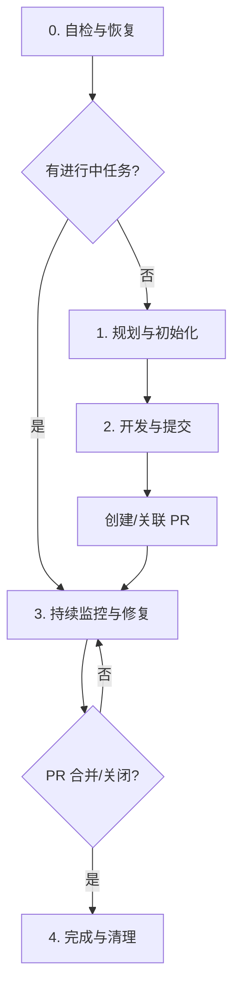

# AI Coding (智慧编码)

本技能提供了一套从需求分析、代码开发、自动化测试到 PR 监控与修复的全自动闭环流程。

**核心理念：AI 是全自动化的执行者，而非提醒者。**

## 🛡️ 核心原则
1. **全自动化闭环**: 创建 PR 后立即启动监控，直到合并或关闭。
2. **零打扰原则**: 自动处理 CI 失败、冲突和 Review 反馈，不询问“是否继续”。
3. **环境纯净**: 开始前同步主分支，结束后清理工作目录。

---

## 🔄 完整工作流程



## 阶段 0: 状态自检与恢复
**入口规则**：AI 响应指令前必须先执行：
```bash
bash scripts/self-check.sh
```
根据脚本输出的 `ACTION` (RESUME_MONITOR, RESUME_DEVELOP, IMPLICIT_TASK_DETECTED) 决定后续动作。

## 阶段 1: 规划与初始化
1. **确认需求**：与用户确认功能和验收标准。
2. **初始化**：如果是新项目，运行 `bash scripts/init-project.sh`。
3. **创建特性分支**。

## 阶段 2: 开发与提交
1. **编码与测试**：按照需求开发，并确保通过本地测试。
2. **资源清理** (UI任务必备)：运行 `bash scripts/resource-scanner.sh`。
3. **提交与 PR**：执行以下逻辑（由 AI 填充具体信息）：
```bash
# 自动执行提交和 PR 关联
bash scripts/submit-pr.sh
```

## 阶段 3: 持续监控与自动修复 (CRITICAL)
**执行完阶段 2 后，必须立即、毫无停顿地进入此阶段。**
```bash
bash scripts/monitor-pr.sh
```
**AI 职责**：
- 当脚本返回 `STATUS: NEED_REFIX_REVIEW`：使用 GraphQL API 分析 Review Threads，修改代码并解决 (Resolve) 所有的 Conversation。
- 当脚本返回 `STATUS: CI_FAILED`：分析 CI 日志并自动修复。
- 当脚本返回 `STATUS: CONFLICT_DETECTED`：自动执行 `git merge` 并解决冲突。

## 阶段 4: 完成与清理
1. **清理环境**：删除 `DEVELOPMENT` 目录。
2. **同步代码**：切回主分支并拉取最新内容。

---

## 🔧 辅助资源
- **脚本目录**: `scripts/` (包含初始化、自检、监控等核心脚本)
- **模板目录**: `templates/` (包含配置和需求文档模板)
- **规范文档**: `references/RESOURCE_CLEANUP.md` (资源扫描规范)
